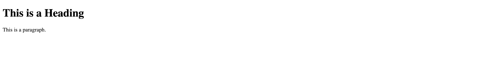
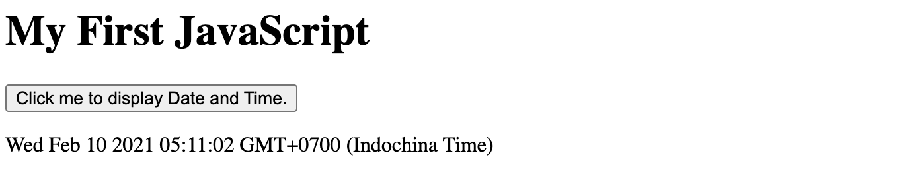

# HTML

## HTML là gì?

* HTML là viết tắt của Hyper Text Markup Language
* HTML là ngôn ngữ đánh dấu tiêu chuẩn để tạo các trang Web
* HTML mô tả cấu trúc của một trang Web
* HTML bao gồm một loạt các phần tử
* Các phần tử HTML cho trình duyệt biết cách hiển thị nội dung
* Các phần tử HTML gắn nhãn các phần nội dung như "đây là một tiêu đề", "đây là một đoạn văn", "đây là một liên kết", v.v.

### Ví dụ HTML đơn giản

```markup
<!DOCTYPE html>
<html>

<head>
    <title>Page Title</title>
</head>

<body>
    <h1>This is a Heading</h1>
    <p>This is a paragraph.</p>
</body>

</html>
```

* `<!DOCTYPE html>` chỉ ra rằng tài liệu này là một tài liệu HTML5
* `<html>` là phần tử gốc của một trang HTML
* `<head>` chứa thông tin meta về trang HTML
* `<title>` chỉ định tiêu đề cho trang HTML \(được hiển thị trong thanh tiêu đề của trình duyệt hoặc trong tab của trang\)
* `<body>` xác định nội dung của tài liệu và là vùng chứa tất cả nội dung hiển thị, chẳng hạn như tiêu đề, đoạn văn, hình ảnh, siêu liên kết, bảng, danh sách, v.v.
* `<h1>` xác định một tiêu đề lớn
* `<p>` xác định một đoạn văn

Kết quả:



### Phần tử HTML là gì?

Phần tử HTML được xác định bởi thẻ bắt đầu, một số nội dung và thẻ kết thúc:

```markup
<tagname> Nội dung </tagname>
```

Phần tử HTML là tất cả mọi thứ từ thẻ bắt đầu đến thẻ kết thúc:

```markup
<h1> Tiêu đề </h1>
<p> Đoạn văn </p>
```


Lưu ý: Một số phần tử HTML không có nội dung \(như phần tử `<br>`\). Các phần tử này được gọi là phần tử rỗng. Các phần tử trống không có thẻ kết thúc!

## Các thẻ HTML căn bản

`<h1>` đến `<h6>`: tiêu đề

`<p>`: đoạn văn bản

`<a>`: đường dẫn

\*Chi tiết các thẻ: [https://htmlreference.io/](https://htmlreference.io/)

\*Các thẻ HTML không phân biệt hoa thường `<H1>` giống với `<h1>` nhưng khuyến khích viết chữ thường

## Thuộc tính HTML

* Tất cả các phần tử HTML có thể có các thuộc tính
* Các thuộc tính cung cấp thông tin bổ sung về các phần tử
* Các thuộc tính luôn được chỉ định trong thẻ bắt đầu
* Các thuộc tính thường có trong các cặp tên / giá trị như: name = "value"

Ví dụ:

* Thuộc tính href của `<a>` quy định cụ thể các URL của trang liên kết đi vào
* Thuộc tính src của `` quy định cụ thể đường dẫn đến hình ảnh sẽ được hiển thị
* Thuộc tính width và height cung cấp thông tin kích thước cho hình ảnh ``
* Thuộc tính alt của `` cung cấp một văn bản thay thế cho hình ảnh
* Thuộc tính style được sử dụng để thêm phong cách cho một yếu tố, chẳng hạn như màu sắc, font chữ, kích thước, và nhiều hơn nữa
* Thuộc tính lang của `<html>` tuyên bố ngôn ngữ của trang web

\*Chi tiết: [https://www.w3schools.com/tags/ref\_attributes.asp](https://www.w3schools.com/tags/ref_attributes.asp)

### HTML styles

Style là thuộc tính HTML được sử dụng để thêm kiểu vào một phần tử, chẳng hạn như màu sắc, phông chữ, kích thước, v.v.

Cú pháp:

```markup
 <tagname style="property:value;">
```

Property là 1 CSS property

Value là 1 Css value

Ví dụ:

```markup
<h1 style="background-color:powderblue;">This is a heading</h1>
<p style="background-color:tomato;">This is a paragraph.</p>
```


### HTML Css

* CSS là viết tắt của Cascading Style Sheets.
* CSS tiết kiệm rất nhiều công việc. Nó có thể kiểm soát bố cục của nhiều trang web cùng một lúc.
* Tìm hiểu chi tiết hơn tại phần Css

Ví dụ:

```markup
<!DOCTYPE html>
<html>

<head>
    <style>
        body {
            background-color: powderblue;
        }

        h1 {
            color: blue;
        }

        p {
            color: red;
        }
    </style>
</head>

<body>
    <h1>This is a heading</h1>
    <p>This is a paragraph.</p>
</body>

</html>
```


### HTML JavaScript

JavaScript làm cho các trang HTML trở nên động và tương tác hơn.

Ví dụ:

```markup
<!DOCTYPE html>
<html>

<body>
    <h1>My First JavaScript</h1>
    <button type="button"
        onclick="document.getElementById('demo').innerHTML = Date()">
        Click me to display Date and Time.</button>
    <p id="demo"></p>
</body>

</html>
```



## HTML Layout

Trang web thường hiển thị nội dung theo nhiều phần và mỗi phần có nhiều cột


### Phần tử HTML layout

HTML có 1 vài phần tử ngữ nghĩa để định nghĩa sự khác nhau giữa các phần trong trang web

<table>
  <thead>
    <tr>
      <th style="text-align:left">
        
      </th>
      <th style="text-align:left">
        <ul>
          <li><code>&lt;header&gt;</code> - &#x111;&#x1ECB;nh ngh&#x129;a m&#x1ED9;t
            header cho m&#x1ED9;t trang ho&#x1EB7;c m&#x1ED9;t ph&#x1EA7;n</li>
          <li><code>&lt;nav&gt;</code> - &#x110;&#x1ECB;nh ngh&#x129;a m&#x1ED9;t b&#x1ED9;
            c&#xE1;c &#x111;&#x1B0;&#x1EDD;ng d&#x1EAB;n &#x111;i&#x1EC1;u h&#x1B0;&#x1EDB;ng</li>
          <li><code>&lt;section&gt;</code> - &#x111;&#x1ECB;nh ngh&#x129;a m&#x1ED9;t
            ph&#x1EA7;n c&#x1EE7;a v&#x103;n b&#x1EA3;n</li>
          <li><code>&lt;article&gt;</code> - &#x111;&#x1ECB;nh ngh&#x129;a m&#x1ED9;t
            ph&#x1EA7;n t&#x1EED; &#x111;&#x1ED9;c l&#x1EAD;p ho&#x1EB7;c ph&#x1EA7;n
            t&#x1EED; ch&#x1EE9;a n&#x1ED9;i dung</li>
          <li><code>&lt;aside&gt;</code> - &#x110;&#x1ECB;nh ngh&#x129;a n&#x1ED9;i dung
            n&#x1EB1;m ngo&#xE0;i n&#x1ED9;i dung ch&#xED;nh(nh&#x1B0; l&#xE0; m&#x1ED9;t
            thanh b&#xEA;n - sidebar )</li>
          <li><code>&lt;footer&gt;</code> - &#x111;&#x1ECB;nh ngh&#x129;a ph&#x1EA7;n
            ch&#xE2;n c&#x1EE7;a trang ho&#x1EB7;c m&#x1ED9;t ph&#x1EA7;n c&#x1EE7;a
            trang</li>
          <li><code>&lt;details&gt;</code> - &#x111;&#x1ECB;nh ngh&#x129;a m&#x1ED9;t
            ph&#x1EA7;n n&#x1ED9;i dung chi ti&#x1EBF;t, ng&#x1B0;&#x1EDD;i d&#xF9;ng
            c&#xF3; th&#x1EC3; m&#x1EDF; ho&#x1EB7;c &#x111;&#xF3;ng t&#xF9;y nhu c&#x1EA7;u</li>
          <li><code>&lt;summary&gt;</code> - &#x111;&#x1ECB;nh ngh&#x129;a ph&#x1EA7;n
            &#x111;&#x1EA7;u c&#x1EE7;a th&#x1EBB; <code>&lt;details&gt;</code>
          </li>
        </ul>
        <p>C&#xF3; th&#x1EC3; xem th&#xEA;m c&#xE1;c th&#x1EBB; kh&#xE1;c t&#x1EA1;i
          &#x111;&#xE2;y <a href="https://www.w3schools.com/html/html5_semantic_elements.asp">HTML Semantics</a>
        </p>
      </th>
    </tr>
  </thead>
  <tbody></tbody>
</table>

### Kỹ thuật chia Layout

Có 4 kỹ thuật chính để tạo layout có nhiều cột, mỗi cách đều có ưu và nhược điểm khác nhau:

* CSS framework: Bulma, Bootstrap, Tailwind,...
* CSS float property
* CSS flexbox
* CSS grid

## HTML Responsive

Responsive web design nói về việc tạo một trang web nhìn ổn trên mọi thiết bị

Một trang web thiết kế responsive sẽ tự động điều chỉnh cho các màn hình hay các khung nhìn khác nhau.

trang web thiết kế responsive sử dụng HTML và CSS để tự động chỉnh kích thước, ẩn, co lại hoặc phóng to các phần tử trong trang để trang web nhìn ổn trên tất cả thiết bị\(máy tính, máy tính bảng hoặc điện thoại\)


### Set viewport - Khung nhìn

```markup
<meta name="viewport" content="width=device-width, initial-scale=1.0">
```

Thẻ meta sẽ đặt giá trị viewport cho trang, nó sẽ hướng dẫn trình duyệt cách kiểm soát chiều và việc điều chỉnh việc co/dãn của trang

Ví dụ:

Không có set viewport


Có set viewport


### Các đơn vị

Cách code responsive đơn giản nhất là code theo các đơn vị tương đối:

* % theo phần trăm
* rem : bằng kích thước font-size của thẻ html
* em : bằng kích thước thẻ cha của phần tử
* vw : viewport width theo kích cỡ width viewport
* vh: viewport height theo kích cỡ height viewport

Các đơn vị tuyệt đối:

* px: bằng 1 điểm ảnh pixel màn hình
* pt: bằng 1 point: 1inch = 72 point

### Media Queries

Một cách chặt chẽ và chi tiết hơn là sử dụng media query để code css theo từng width cụ thể:

```markup
<style>
    .left,
    .right {
        float: left;
        width: 20%;
        /* The width is 20%, by default */
    }

    .main {
        float: left;
        width: 60%;
        /* The width is 60%, by default */
    }

    /* Use a media query to add a breakpoint at 800px: */
    @media screen and (max-width: 800px) {

        .left,
        .main,
        .right {
            width: 100%;
            /* The width is 100%, when the viewport is 800px or smaller */
        }
    }
</style>
```

Các thư viện dùng để responsive: Bulma, Bootstrap, Tailwind,...

## Bài tập

Bài 1: code giao diện


Bài 2: Code giao diện cho desktop và mobile


Bài 3: code giao diện\(chỉ có hình của 1 chiếc lá bên trái chứ không hình chiếc lá bên phải\)


