# CSS

## Css là gì

* CSS viết tắt của Cascading Style Sheets
* CSS miêu tả phần tử HTML được hiển thị như thế nào trên màn hình
* CSS giúp tiết kiệm công sức bởi vì có thể kiểm soát bố cục của nhiều trang web chỉ cần một lần thao tác
* Danh sách các style nội bộ được lưu trong nhiều file CSS

Ví dụ:

-Không có CSS:

-Có CSS

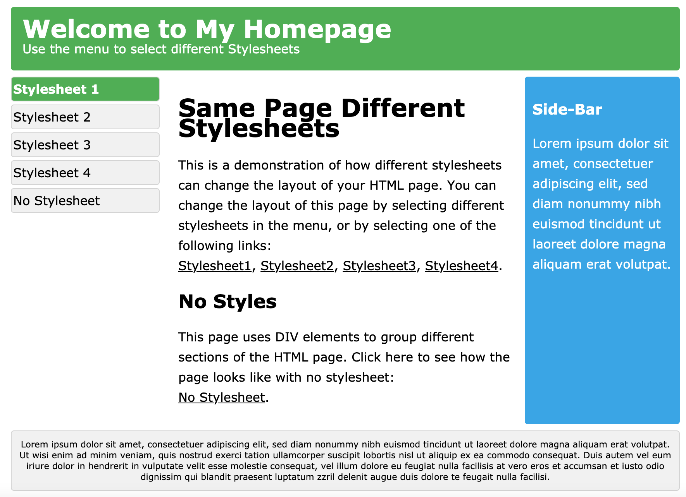

## Cú pháp

Một luật CSS bao gồm selector và một khối khai báo

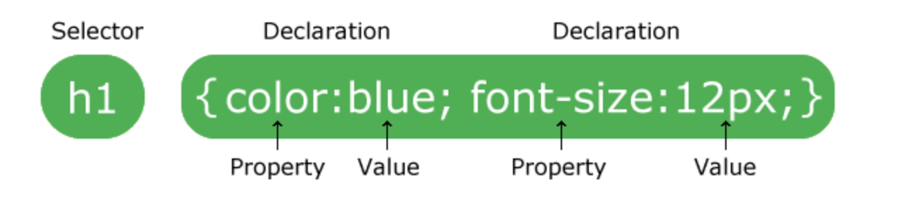

* Selector chỉ ra phần tử HTML muốn chỉnh style
* Khối khai báo chứa một hoặc nhiều khai báo cách nhau bởi dấu chấm phẩy
* Mỗi khai báo bao gồm một thuộc tính CSs và một giá trị cách nhau bởi dấu hai chấm
* Những định nghĩa Css được cách nhau bởi dấu chấm phẩy, và các khối định nghĩa được bao quanh bởi dấu ngoặc nhọn

## Cách khai báo Selector

.class1 : chọn tất cả phần tử chứa class1

.class1.class2 : chọn tất cả phần tử chứa cả class1 và class2

.class1 .class2 : chọn tất cả phần tử chứa class2 và phần tử đó nằm trong phần tử chứa class1

\#id1 : chọn phần tử đầu tiên chứa id1

\* : chọn tất cả phần tử

p: chọn tất cả phần tử thẻ p

.class1,.class2 : chọn tất cả phần tử chứa class1 và tất cả phần tử chứa class2

.class1 &gt; .class2 : chọn phần tử chứa class2 đầu tiên và phần tử đó nằm trong class1

.class1:hover : css xảy ra khi phần tử chứa class1 được rê chuột vào

Img\[alt\] : chọn tất cả các thẻ img chứa thuộc tính alt

Xem thêm: [https://www.w3schools.com/cssref/css\_selectors.asp](https://www.w3schools.com/cssref/css_selectors.asp)

## Cách thêm css vào 1 trang web:

###  cách 1: thêm trực tiếp vào thẻ \(Inline\):

* Cách thêm trược tiếp vào thẻ sẽ bỏ qua định danh của thẻ
* chỉ thẻ được thêm css vào mới có các tính năng trong css đó
* Cách thêm:

###  Cách 2: thêm vào trong file html dưới dạng 1 thẻ style \(embed\):

* các selector sẽ được bọc trong 1 thẻ &lt;style&gt;&lt;/style&gt;
* ví dụ
* 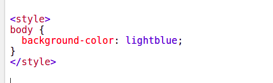

### Cách 3: Thêm dưới dạng 1 file có đuôi .css \(linked\)

* trong file \*.css sẽ là danh sách các selector có các thuộc tính và giá trị
* Thông thường sẽ thêm vào bên trong thẻ head của file .htm
* cách thêm:
* 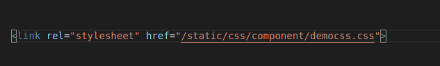
* với href là đường dẫn đến file .css cần thêm

### Độ ưu tiên của các selector trong css

* sự ưu tiên của CSS là Inline =&gt; embed =&gt; linked
* Thuộc tính đánh dấu quan trọng trong CSS
* Khi các CSS của bạn đã được sắp xếp theo một cách trật tự, nhưng bạn vẫn muốn một thuộc tính css nào đó tác động đến đối tượng và vượt qua các css được ưu tiên hơn thì bạn cần sử dụng thêm một thuộc tính để đánh dấu rằng thuộc tính đó phải được ưu tiên sử dụng trước, mặc dù nó được sắp xếp ở mức ưu tiên thấp hơn.
* Thuộc tính để đánh dấu tầm quan trọng trong css đó là: !important

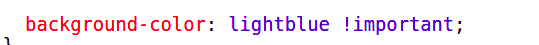

### Ví dụ cơ bản:

#### 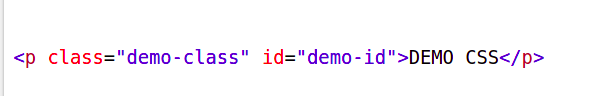

Ta có 1 thẻ như hình, và mong muốn màu nền của thẻ này là màu đỏ, ta có thể sử dụng cách sau:

 cách 1:

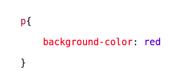

 Dịch nghĩa: Tất cả các thẻ p sẽ có nền là màu đỏ

 cách 2:

 Dịch nghĩa : Tất cả các class tên demo-class sẽ có nền màu đỏ

 cách 3:

 Dịch: id có tên demo-class sẽ có nền màu đỏ

Ta sẽ được kết quả như sau:

## Các thuộc tính thường được sử dụng và diễn giải:

1, color : màu chữ của thẻ . [ví dụ](https://www.w3schools.com/css/tryit.asp?filename=trycss_color)

2, background-color: màu nền của thẻ. [ví dụ](https://www.w3schools.com/cssref/pr_background-color.asp)

3, border: khung viền của thẻ, [ví dụ](https://www.w3schools.com/css/css_border.asp)

4, padding : khoảng cách từ chữ đến viền của chữ: [ví dụ](https://www.w3schools.com/css/css_padding.asp)

5, margin: khoảng cách từ viền của thẻ trở ra ngoài [ví dụ](https://www.w3schools.com/css/css_margin.asp)

6, border-radius: độ cong của viền, [ví dụ](https://www.w3schools.com/cssref/css3_pr_border-radius.asp)

Xem thêm: [https://www.w3schools.com/cssref/css3\_pr\_align-content.asp](https://www.w3schools.com/cssref/css3_pr_align-content.asp)

## Box model CSS

Trong Css, khái niệm “box model” được sử dụng để nói về bố cục hoặc thiết kế

Css box model là bản chất của việc các thuộc tính Css bao quanh mỗi phần tử HTML bao gồm: margin,border,padding và nội dung\(content\) của phần tử như hình sau:

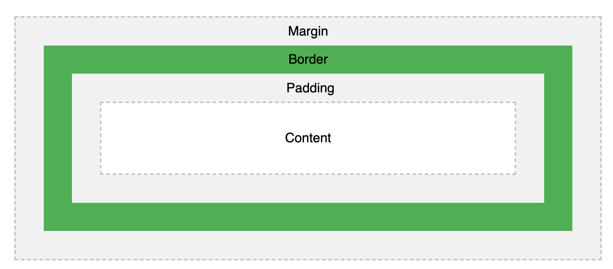

Cách các thuộc tính bao quanh 1 đối phần tử HTML

Giải thích sự khác nhau giữa các phần:

* Content - Nội dung của box chứa chữ, hình ảnh,...
* Padding - Bù một khoảng trong suốt xung quanh nội dung\(content\)
* Border - Một khung viền bao quanh padding và content
* Margin - Bù trừ một khoảng bên ngoài của border, margin trong suốt

Box model chấp nhận việc chúng ta thêm một khung viền xung quanh phần tử, và định nghĩa khoảng trống xung quanh phần tử

## Đơn vị

Gồm 2 loại đơn vị là đơn vị tương đối và đơn vị tuyệt đối:

### Tuyệt đối

* cm: centimeters
* mm: millimeters
* in: inches \(1in = 96px = 2.54cm\)
* px \*: pixels \(1px = 1/96th of 1in\)
* pt: points \(1pt = 1/72 of 1in\)
* pc: picas \(1pc = 12 pt\)

\* Pixels \(px\) liên quan đến thiết đang xem. Với thiết bị low-dpi \(dots per linear : độ nhạy chuột\), 1px is pixel \(dot\) điểm của thiết bị hiển thị. Với thiết bị có độ nhạy cao 1px tức là nhiều điểm ảnh.

### Tương đối

Đơn vị tương đối không có giá trị cụ thể mà phải dựa vào các đơn vị khác để xác định nên giúp cho việc co giãn tốt hơn trên nhiều thiết bị có kích thước khác nhau

* em bằng font-size của phần tử cha
* ex bằng chiều cao của font hiện tại
* ch bằng chiều dài của chữ số 0
* rem bằng font-size của phần tử html
* vw bằng 1% của chiều dài\(width\) khung nhìn
* vh bằng 1% của chiều cao\(height\) khung nhìn
* vmin bằng 1% của chiều nhỏ hơn của khung nhìn
* vmax bằng 1% của chiều lớn hơn của khung nhìn
* % bằng 1% của phần tử cha

## Display

Đa số display mặc định của các phần tử là inline

### Inline

Giống như các thẻ &lt;span&gt;, &lt;em&gt;, &lt;b&gt; , các text trong thẻ sẽ xuống dòng khi quá giới hạn chiều dài nhưng không làm mất luồng của dòng chứa phần tử

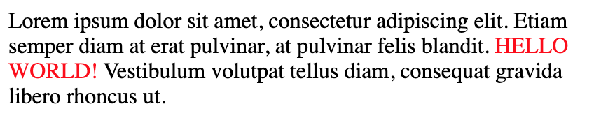

Inline không chấp nhận thuộc tính height, width nhưng có padding, margin

### Inline-block

Khá giống với Inline, vẫn sẽ tuân thủ quy tắc luồng của chữ, khác khi các chữ trong dòng sẽ không tách nhau khi vượt giới hạn chiều dài và chấp nhận thuộc tính width, height

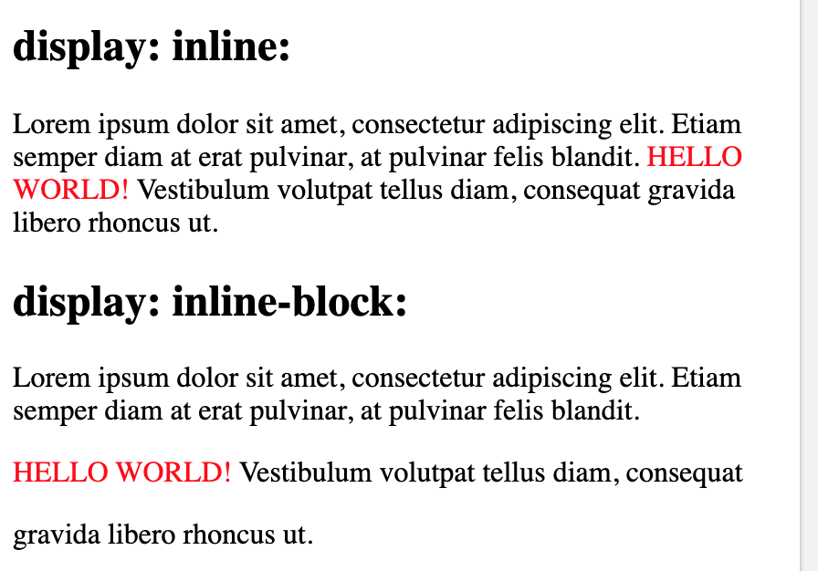

### Block

Một số phần tử được gán giá trị block mặc định, thường là các phần tử chứa các phần tử khác như &lt;div&gt;, &lt;section&gt;, &lt;ul&gt; hoặc các “blocks” như &lt;p&gt; and &lt;h1&gt;. Các phần tử có giá trị Block không nằm theo luồng của dòng mà sẽ cố gắng chiếm chiều ngang tối đa có thể nếu không được set width cụ thể

### None

display: none; thường được sử dụng với JavaScript để ẩn và hiện các phần tử mà không cần xóa và tạo lại chúng. Các phần tử có display: none sẽ không hiển thị trên giao diện

thẻ &lt;script&gt; sử dụng display: none; làm thuộc tính display mặc định

### Flex

display: flex khác với các loại khác nó không quy định cách hiển thị của chính nó mà quy định cách sắp xếp của các phần tử con 1 cách linh hoạt, cách sử dụng thông thường là các phần tử con sẽ có thuộc tính width, khi các phần tử con quá chiều dài khung màn hình của dòng đó sẽ tự động xuống dòng chứ không overflow-x

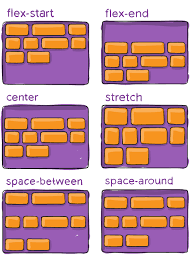

## Position

Thuộc tính position quy định hàm xác định vị trí mà phần tử sử dụng

### Static

Thẻ HTML mặc định position là static

Phần tử có position: static; sẽ không bị ảnh hưởng bởi các thuộc tính top, right,bottom,left và tuân theo luồng sắp xếp mặc định của trang

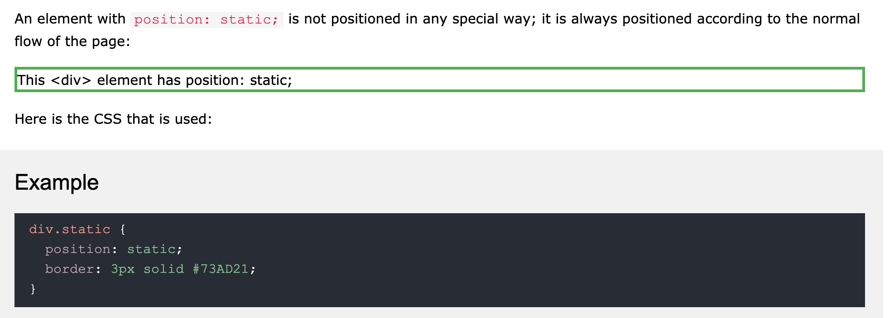

### Relative

Phần tử có position: relative; xác định vị trí mới dựa vào vị trí bình thường của nó thông qua việc cấu hình các thuộc tính top,right,bottom,left của phần tử

* Lưu ý nội dung sẽ không tự điều chỉnh theo khoảng trống do phần tử để lại

Setting the top, right, bottom, and left properties of a relatively-positioned element will cause it to be adjusted away from its normal position. Other content will not be adjusted to fit into any gap left by the element.

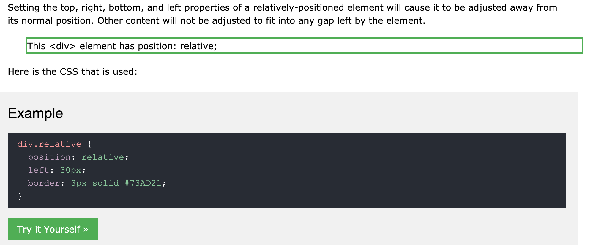

### Fixed

Phần tử có position: fixed; cũng sử dụng thuộc tính top,right,bottom,left để quy định vị trí nhưng sẽ phụ thuộc vào viewport của màn hình tức là vị trí của phần tử không đổi khi scroll trang

Một phần tử fixed không để lại khoảng trống tại vị trí đặt phần tử trên trang

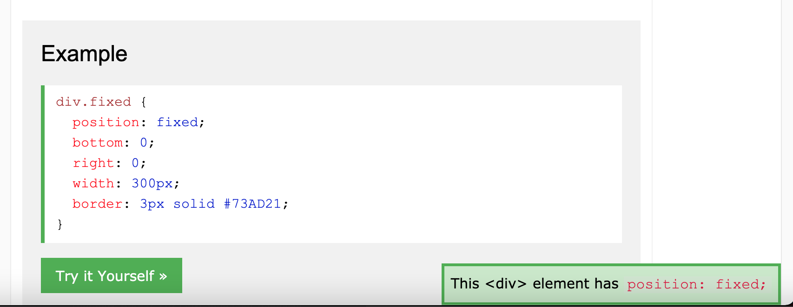

### Absolute

Phần tử có position: absolute; phụ thuộc vào phần tử tổ tiên\(cha, ông, cố\) được quy định position khác static gần nhất thay vì dựa vào viewport như fixed, nếu không có phần tử tổ tiên phù hợp thì phần tử sẽ lấy phần tư body của trang để đối chiếu và di chuyển khi scroll trang.

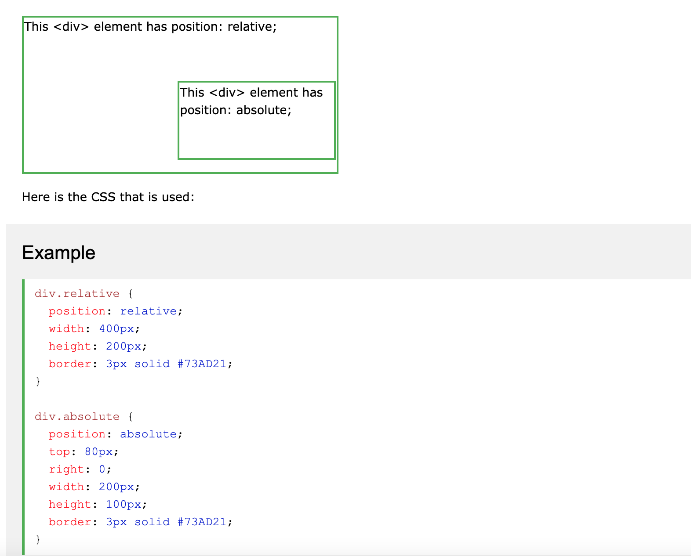

### Sticky

Phần tử có position: sticky; dựa trên việc user scroll trang để xác định vị trí, cụ thể hơn phần tử sẽ bật tắt giữa relative và fixed dựa vào vị trí cuộn

X vị trí hiện tại -- root vị trí được quy định

⇒ X &gt;= root : fixed

⇒ X &lt; root: static

### z-index

Các phần tử chồng chéo lên nhau theo thứ tự được quy định bằng thuộc tính z-index, z-index của phần tử cao sẽ giúp phần tử đè lên phần tử có z-index thấp hơn

## !important

### !important là gì

!important trong CSS được sử dụng để thêm sự quan trọng của 1 thuộc tính hơn so với bình thường, nếu sử dụng !important sẽ đè **tất cả** các khai báo trước định nghĩa style của của phần tử

### Đè !important

Có 1 cách duy nhất để đè !important là thêm !important vào rule css có selector ngang hoặc mạnh hơn trong source code, điều này gây ra những sự nhầm lẫn và debug sẽ khó hơn rất nhiều

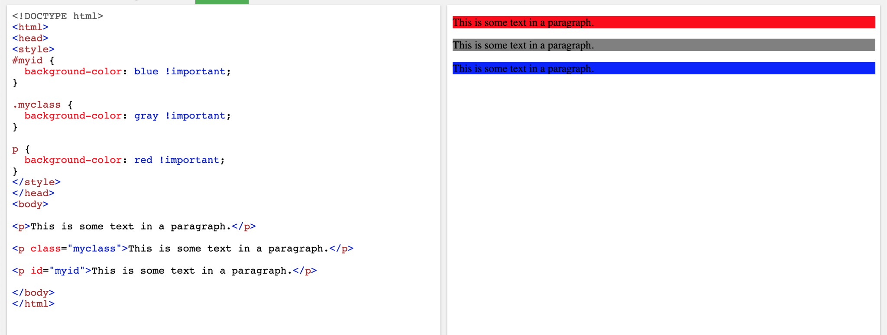

⇒ hãy cân nhắc khi sử dụng !important

## Bài tập

* bài tập căn bản:

 1,Tạo ra 1 nút\(button\) tương tự như hình:

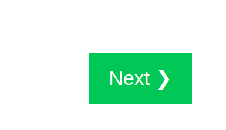

 2, nút của câu 1 khi rê chuột vào, nút chuyển sang màu đỏ

 3, làm 1 trang web giống hình dưới

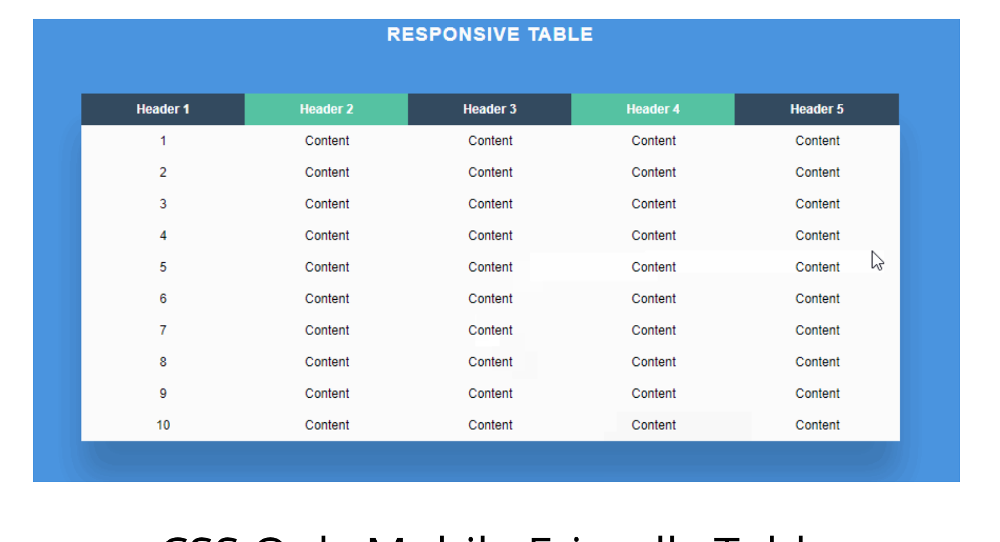

## Responsive

Responsive web design nói về việc tạo một trang web nhìn ổn trên mọi thiết bị

Một trang web thiết kế responsive sẽ tự động điều chỉnh cho các màn hình hay các khung nhìn khác nhau.

trang web thiết kế responsive sử dụng HTML và CSS để tự động chỉnh kích thước, ẩn, co lại hoặc phóng to các phần tử trong trang để trang web nhìn ổn trên tất cả thiết bị\(máy tính, máy tính bảng hoặc điện thoại\)

### Set viewport - Khung nhìn

&lt;meta name="viewport" content="width=device-width, initial-scale=1.0"&gt;

Thẻ meta sẽ đặt giá trị viewport cho trang, nó sẽ hướng dẫn trình duyệt cách kiểm soát chiều và việc điều chỉnh việc co/dãn của trang

Ví dụ:

Không có set viewport

Có set viewport

### Các đơn vị

Cách code responsive đơn giản nhất là code theo các đơn vị tương đối:

* % theo phần trăm
* rem : bằng kích thước font-size của thẻ html
* em : bằng kích thước thẻ cha của phần tử
* vw : viewport width theo kích cỡ width viewport
* vh: viewport height theo kích cỡ height viewport

Các đơn vị tuyệt đối:

* px: bằng 1 điểm ảnh pixel màn hình
* pt: bằng 1 point: 1inch = 72 point

### Media Queries

Một cách chặt chẽ và chi tiết hơn là sử dụng media query để code css theo từng width cụ thể:

&lt;style&gt;

.left, .right {

 float: left;

 width: 20%; /\* The width is 20%, by default \*/

}

.main {

 float: left;

 width: 60%; /\* The width is 60%, by default \*/

}

/\* Use a media query to add a breakpoint at 800px: \*/

@media screen and \(max-width: 800px\) {

 .left, .main, .right {

 width: 100%; /\* The width is 100%, when the viewport is 800px or smaller \*/

 }

}

&lt;/style&gt;

Các thư viện dùng để responsive: Bulma, Bootstrap, Tailwind,...

