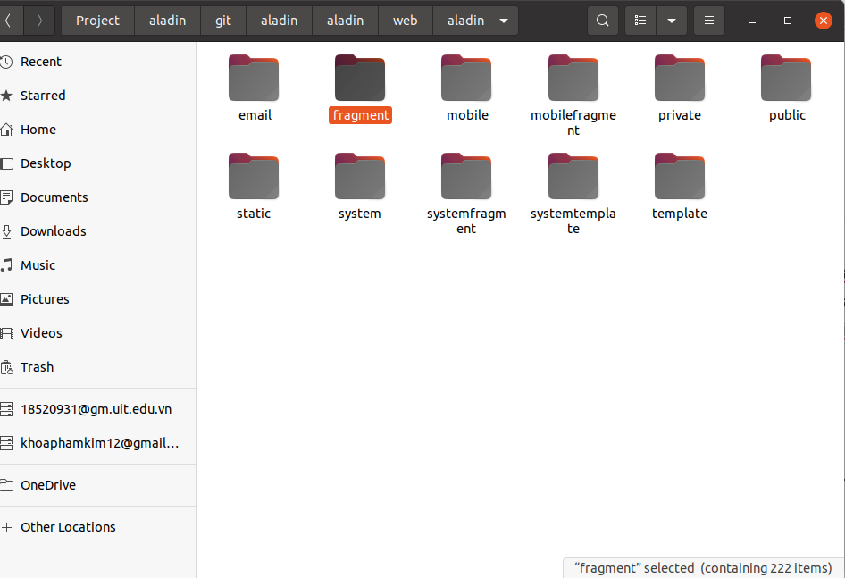
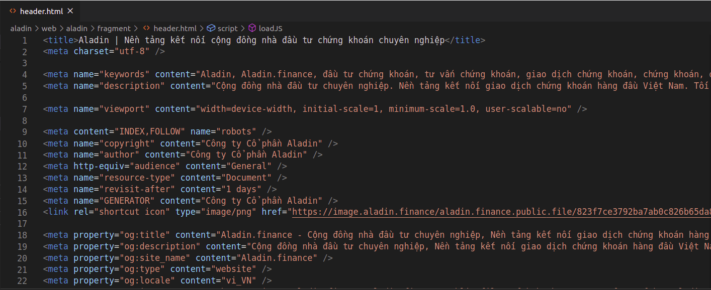
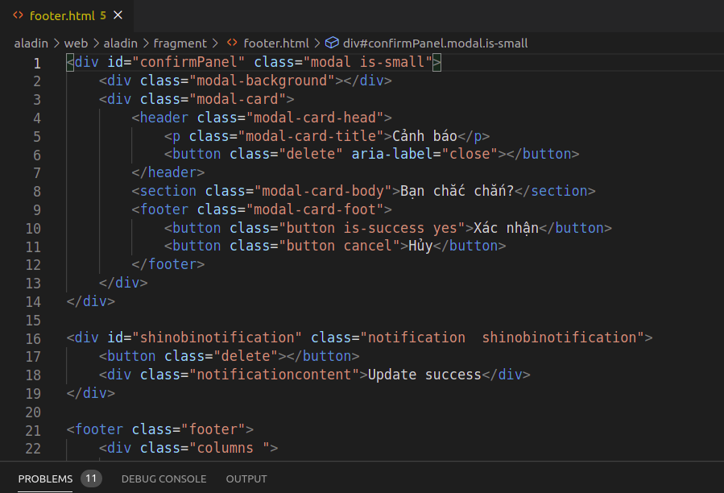
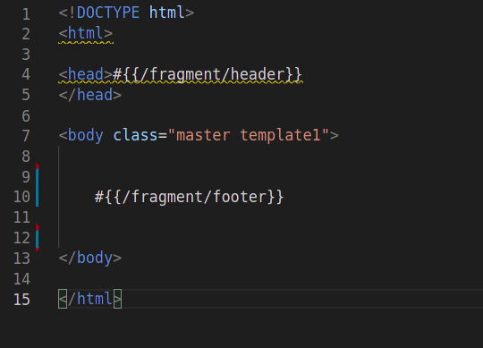
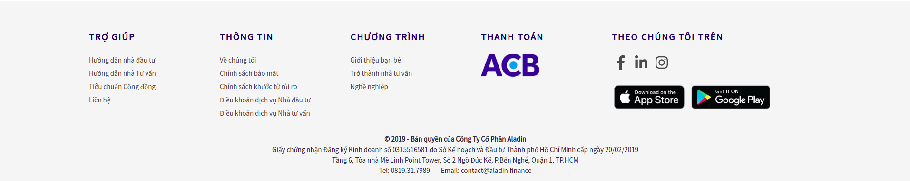
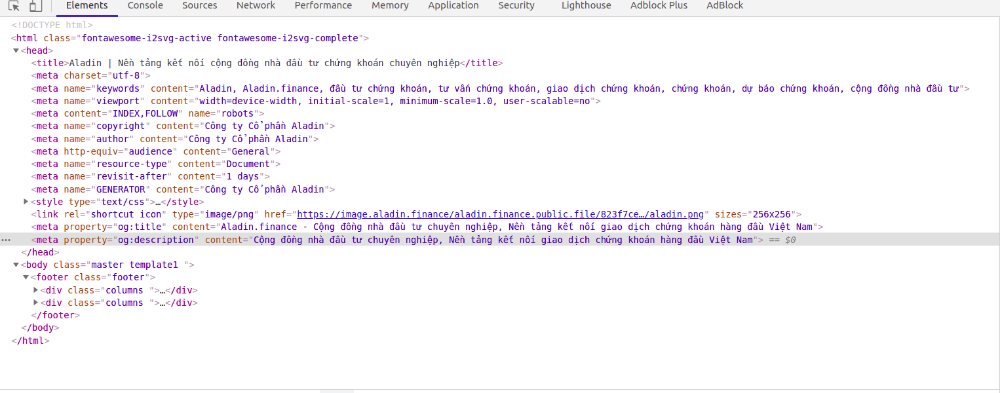

# Fragment

Trong một hệ thống giao diện web \( giao diện aladin\) , các khối html  giống  nhau có thể  lặp đi lặp lại nhiều lần, để tránh việc lặp đi lặp lại nhiều lần, fragment sẽ chứa một khối html sử dụng chung cho các  trang web sử dụng khối html trong fragment, khi này các trang cần khối html trong fragment, chỉ cần thêm fragment vào các trang mà không cần code lại. 

Trong hệ thống của aladin, toàn bộ các  fragment sẽ được lưu trong folder tên  "fragment"

\(link: /aladin/web/aladin/fragment \);



### Cách sử dụng

#### \* Lưu ý: 

* Khi tạo các fragment mới, các bạn phải bỏ vào thư mục tên fragment có sẵn trên aladin, mục đích nhằm dễ quản lí code và thống nhất cấu trúc  trong aladin .
*  ****Không thể thao tác bằng JS để thêm fragment vào trang web bất kì,  chỉ có thể import trực tiếp vào file html, Vì : Trình tự hành vi khi client lấy dữ liệu tới một trang : client gọi một DNS =&gt; Server  tiếp nhập  =&gt; server  thêm các khối html trong các fragment vào trang client gọi tới =&gt; trả về phía client &gt;client nhận dữ liệu, chạy JS có trong file trả về. Vì JS chạy sau cùng trên client, nên không thể thêm fragment vào file html.



```text
#{{@Đường_dẫn_đến_fragment}}
```





```text
#{{/fragment/@Tên_fragment_cần_cho_trang}}
```



###  Ví dụ: 

Trong hệ Aladin có các fragment không thể thiếu như : header, footer

* file  header: 



* file footer  :



Khi ta import 2 file header.html và footer.html vào trong 1 trang web như sau:

* file html:



* Hiển  thị trên giao diện:



* Còn đây là code phía client hiểu được



 


